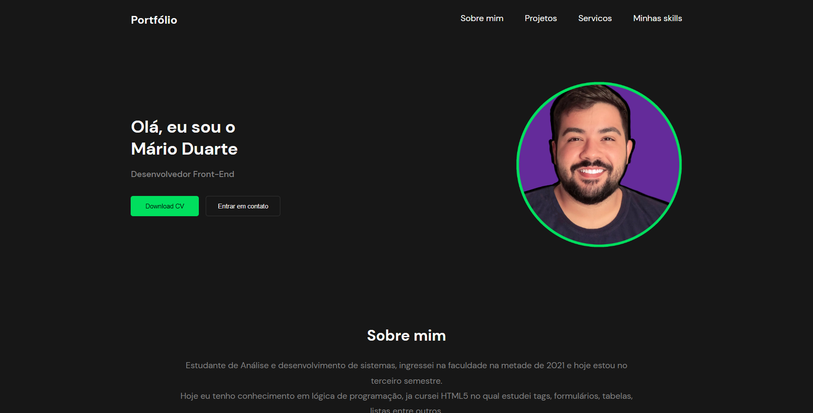

<h1 align="center"> Desadio 2 </h1>

  <a href="#-tecnologias">Tecnologias</a>&nbsp;&nbsp;&nbsp;|&nbsp;&nbsp;&nbsp;
  <a href="#-projeto">Projeto</a>&nbsp;&nbsp;&nbsp;|&nbsp;&nbsp;&nbsp;
  <a href="#-layout">Layout</a>&nbsp;&nbsp;&nbsp;|&nbsp;&nbsp;&nbsp;

 

  

## 🚀 Tecnologias

Esse projeto foi desenvolvido com as seguintes tecnologias:

- HTML e CSS
- JavaScript

## 💻 Projeto

Meu portifólio é um projeto que mostra minhas SKILLS e projetos já feito e feito deploy pelo github.

## 🔖 Layout

Você pode visualizar o layout do projeto através [DESSE LINK](https://www.figma.com/file/Yb9IBH56g7T1hdIyZ3BMNO/Desafios---Codel%C3%A2ndia?node-id=13190%3A2&t=ezDliFCruNlbLCcD-0). É necessário ter conta no [Figma](https://figma.com) para acessá-lo.

Projeto desenvolvido por mim [Mário Duarte](https://www.linkedin.com/in/mario-duarte-3923431b8) e design feito por [Iuri Silva](https://www.linkedin.com/in/iuricode).

